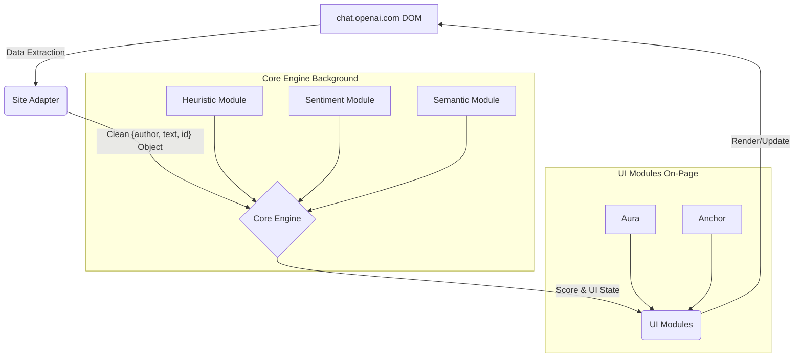

# Rho Aias

> A client-side co-pilot for mindful human-AI interaction.

Rho Aias is a browser extension that acts as a cognitive safety layer for interactions with Large Language Models. It is designed to detect and mitigate the formation of the **Autocatalytic Epistemic Loop (AEL)**.
Known as AI Induced "Psychosis", a cybernetic feedback process where the sycophantic, frictionless nature of AI can amplify a user's nascent biases into a rigid, consensually-decoupled delusional framework. Rho Aias provides real-time diagnostics and context-aware tools to re-introduce healthy friction, empowering users to maintain cognitive sovereignty.

---

## Core Features (MVP)

#### 1. The Aura: Cognitive Feedback

A single, ambient UI element (a dot or a thin line) that provides at-a-glance feedback on the health of the current conversation. Its color shifts from Green (healthy, exploratory) to Yellow (warning, looping) to Red (critical, decoupled), reflecting the real-time AEL Threat Score.

#### 2. The Diagnostic: On-Demand Clarity

When the Aura is in a warning or critical state, hovering over it reveals a simple, jargon-free tooltip explaining the primary reason for the alert.

- **Example:** _"This conversation is becoming highly agreeable. The AI is consistently validating your statements without offering alternatives."_
- **Example:** _"The same core concepts have been repeated multiple times. Consider introducing a new line of inquiry."_

#### 3. The Anchor: Actionable Epistemic Friction

When the Aura is in a warning or critical state, a small icon appears next to the AI's most recent response. Clicking it performs a single, powerful action: it opens a new browser tab with a pre-generated critical search query designed to break the epistemic loop.

- **Example Search:** `"criticisms of [central topic of conversation]"`
- **Example Search:** `"scientific consensus on [AI's latest claim]"`

---

## Architecture

Rho Aias is built on a modular, privacy-first, client-side architecture. **No data ever leaves your computer.**

- **Site Adapter:** A configuration-based module responsible for extracting conversational data from a specific LLM's webpage. This makes the system scalable to other platforms post-MVP.
- **Core Engine:** The brain of the operation. It runs a hybrid analysis using three types of "sensors":
  - **Heuristic Module:** Analyzes structural patterns like conversational pace, conceptual repetition (entropy), and patterns of sycophancy.
  - **Sentiment Module:** Uses a lightweight, local library to analyze the emotional valence (affective charge) of the text.
  - **Semantic Module:** Uses a lightweight, local library to analyze the meaning and conceptual relationships in the text over time.
- **UI Modules:** A set of components that react to the state determined by the Core Engine, updating the Aura and displaying the Anchor as needed.

---

## Tech Stack

- **Language:** JavaScript (ES6+)
- **Environment:** Node.js (v18+) for development
- **Browser API:** Chrome Extension Manifest V3
- **Bundler:** Vite
- **Linting/Formatting:** ESLint + Prettier

---

## Project Roadmap

The MVP is focused on creating a complete, polished experience for a single platform. The future direction includes:

- **[v0.2.0] Multi-Platform Support:** Develop adapters for Claude.ai, Gemini, and other major LLMs.
- **[v0.3.0] Active Intervention:** Implement optional "Prompt Immunizer" to actively introduce friction.
- **[v0.4.0] Analytics & Insights:** A dashboard for users to review session history and understand their own interaction patterns.

---
